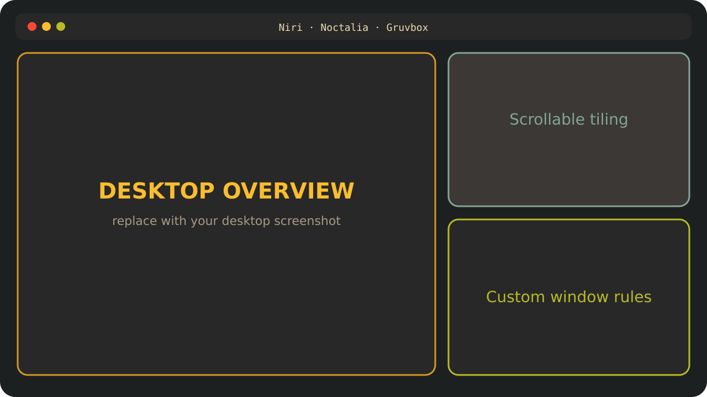
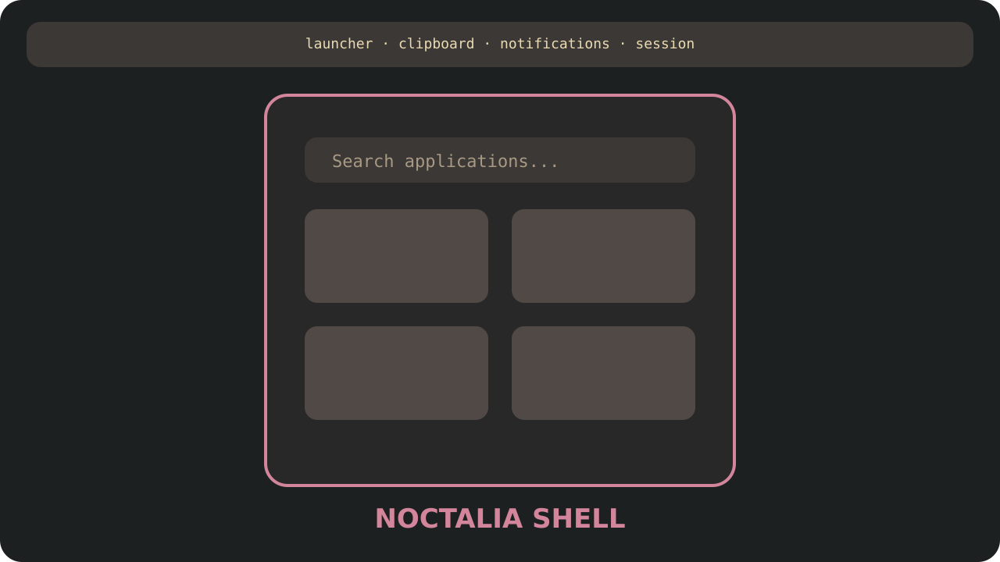
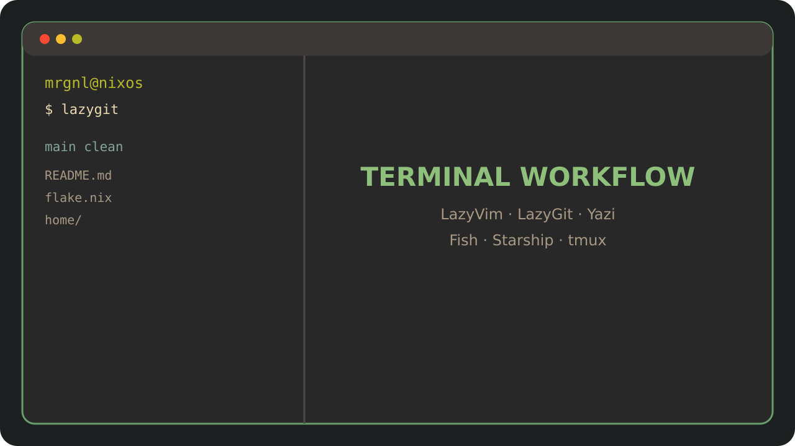
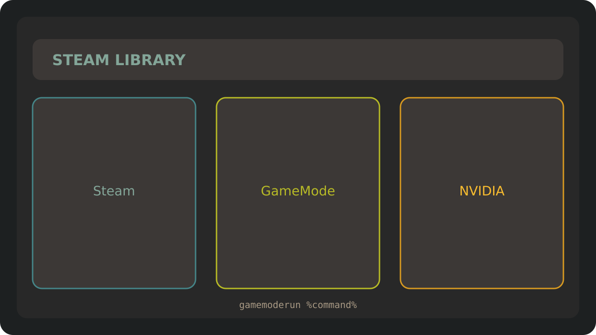

<div align="center">

# mrgnl NixOS

**A reproducible Gruvbox desktop built around Niri, Noctalia 5 and Home Manager**


</div>

This repository is the source of truth for my complete NixOS environment:
system services, hardware profiles, desktop behavior, applications, terminal
tools and dotfiles. The same modular configuration targets my current ThinkPad
and three future Intel/NVIDIA desktops.

## Screenshots

<table>
  <tr>
    <td width="50%">
      
      <p align="center"><b>Niri desktop</b><br>Scrollable tiling, Gruvbox and Noctalia</p>
    </td>
    <td width="50%">
      
      <p align="center"><b>Noctalia shell</b><br>Launcher, bar, clipboard and session controls</p>
    </td>
  </tr>
  <tr>
    <td width="50%">
      
      <p align="center"><b>Terminal workflow</b><br>Kitty, Fish, LazyVim, LazyGit and Yazi</p>
    </td>
    <td width="50%">
      
      <p align="center"><b>Gaming</b><br>Steam, GameMode and NVIDIA-ready profiles</p>
    </td>
  </tr>
</table>

The gallery currently uses Gruvbox placeholders. Replace the four PNG files
with real screenshots while keeping the same filenames and `1280x720` aspect
ratio to update the GitHub page without changing the README layout.

## Highlights

| | Feature | What it provides |
| --- | --- | --- |
| **Desktop** | Niri + Noctalia 5 | Scrollable Wayland tiling, launcher, bar, notifications, clipboard, lock screen and session controls |
| **Consistent UI** | Gruvbox Dark | Shared colors across Noctalia, Niri, Kitty, btop, Yazi and LazyVim |
| **Developer setup** | LazyVim everywhere | `nvim` is the default editor for the shell, Git tools, Yazi and common text MIME types |
| **Gaming** | Steam + GameMode | 32-bit graphics support, performance mode and a Steam FHS wrapper that also works from `/etc/nixos` |
| **Four hosts** | Intel + NVIDIA profiles | Active ThinkPad plus buildable RTX 4060 Ti 16 GB, RTX 4090 and RTX 5060 targets |
| **Maintenance** | Automated cleanup | Weekly generation cleanup, Nix store optimisation and bounded journal storage |
| **Validation** | Project checker | Parses every Nix file, validates Markdown, builds hosts and checks generated Niri/Noctalia configuration |
| **Secrets** | Kept outside Git | AmneziaWG credentials remain root-owned under `/etc/amnezia/` |

## Desktop Experience

- Niri scrollable tiling with custom layout, rules, animations and blur.
- Noctalia 5 provides one integrated shell instead of several overlapping
  daemons.
- A single Gruvbox palette keeps the desktop and terminal applications
  visually consistent.
- Xwayland Satellite supports applications that still require X11.
- The Xiaomi ultrawide is pinned to `3440x1440@100.000`, the maximum mode
  exposed by the current connection.
- The laptop panel and external monitor layout are selected per host.

### Main Keybinds

| Shortcut | Action |
| --- | --- |
| `Mod + Return` | Open Kitty |
| `Mod + D` | Open Noctalia launcher |
| `Mod + B` | Open Firefox |
| `Mod + E` | Open Nautilus |
| `Mod + V` | Open clipboard history |
| `Mod + Alt + L` | Lock the session |
| `Mod + Shift + Q` | Open session menu |
| `Mod + O` | Toggle Niri overview |
| `Mod + F` | Toggle fullscreen |
| `Mod + T` | Toggle floating mode |
| `Ctrl + Shift + 1/2/3` | Screenshot selection/screen/window |

## Software

| Area | Components |
| --- | --- |
| Base | NixOS 26.05, flakes, latest Linux kernel, systemd-boot |
| Session | greetd, tuigreet, Niri, Noctalia 5, Xwayland Satellite |
| Terminal | Kitty, Fish, Starship, tmux |
| Editor | Neovim, LazyVim, Tree-sitter |
| CLI | Yazi, btop, Fastfetch, Git/Delta, LazyGit, fzf, zoxide, ripgrep, fd, eza |
| Development | GitHub CLI, ast-grep, hyperfine, LazyDocker, jq, yq |
| Desktop | Firefox, Nautilus, Obsidian, Spotify, Telegram, Transmission |
| Gaming | Steam, GameMode, 32-bit OpenGL/Vulkan support |
| Network | NetworkManager and declarative AmneziaWG service wiring |

## Hosts

| Host | Status | Hardware profile |
| --- | --- | --- |
| `t14` | Active | Lenovo ThinkPad, Intel graphics, laptop power management |
| `i5-4060ti` | Migration target | Intel i5, NVIDIA RTX 4060 Ti 16 GB, open NVIDIA kernel module |
| `i5-4090` | Migration target | Intel i5, NVIDIA RTX 4090 24 GB, open NVIDIA kernel module |
| `i5-5060` | Migration target | Intel i5, NVIDIA RTX 5060, open NVIDIA kernel module |

All desktop targets can be evaluated and fully built today, but they
intentionally use a temporary root filesystem until each real machine
generates its own hardware configuration:

```text
host/i5-4060ti/hardware-configuration.nix
host/i5-4090/hardware-configuration.nix
host/i5-5060/hardware-configuration.nix
```

Do not install or switch either desktop target before replacing its fallback
with the hardware configuration generated on that target PC.

## Repository Layout

```text
.
├── flake.nix                 inputs and host registry
├── lib/mk-host.nix           shared NixOS + Home Manager constructor
├── host/
│   ├── t14/                  active laptop hardware and composition
│   ├── i5-4060ti/            RTX 4060 Ti 16 GB migration target
│   ├── i5-4090/              RTX 4090 24 GB migration target
│   └── i5-5060/              RTX 5060 migration target
├── modules/
│   ├── core/                 boot, Nix, locale, networking, security
│   ├── desktop/              greetd and Niri system integration
│   ├── hardware/             audio, Bluetooth, power and GPU support
│   ├── networking/           AmneziaWG service wiring
│   ├── packages/             system CLI, GUI and gaming software
│   ├── profiles/             reusable system compositions
│   └── users/                local account configuration
├── home/
│   ├── common/               shared Gruvbox palette and GTK theme
│   ├── desktop/              generated Niri and Noctalia configuration
│   ├── packages/             daily user tools grouped by task
│   └── programs/             application-specific Home Manager modules
└── scripts/check.sh          project validation entrypoint
```

The ownership rule is simple:

- `host/` describes a specific machine.
- `modules/` owns reusable NixOS system behavior.
- `home/` owns the `mrgnl` user environment and dotfiles.

## Build And Validate

Run the quick checker for a normal change:

```sh
cd /etc/nixos
scripts/check.sh quick t14
```

Use the full cross-host check after changing shared modules, profiles, desktop
infrastructure, Home Manager wiring, flake inputs or host definitions:

```sh
scripts/check.sh full t14
```

The checker:

1. Parses every local Nix file.
2. Checks Markdown fences and Nix formatting.
3. Evaluates all flake outputs.
4. Dry-builds the selected host.
5. Validates generated Niri and Noctalia configuration.
6. Builds `t14`, `i5-4060ti`, `i5-4090` and `i5-5060` in full mode.
7. Rejects patch whitespace errors.

## Apply

Apply the configuration only for the machine currently in use:

```sh
sudo nixos-rebuild switch --flake .#t14 --accept-flake-config
```

Fish also provides a host-aware shortcut:

```sh
rebuild
```

After activation:

```sh
systemctl --failed
systemctl --user --failed
systemctl status home-manager-mrgnl.service
niri validate -c ~/.config/niri/config.kdl
noctalia config validate ~/.config/noctalia
```

## Gaming Notes

Steam and GameMode are enabled system-wide. The first Steam launch downloads
the current client before showing the sign-in window.

To enable GameMode for a game, use this Steam launch option:

```text
gamemoderun %command%
```

After initially enabling GameMode, sign out and back in once so the desktop
session receives membership in the restricted `gamemode` group.

## Automatic Maintenance

- systemd-boot keeps at most 10 generations;
- Nix generations older than 14 days are removed weekly;
- the Nix store is optimised weekly;
- persistent journal storage is limited to 256 MiB and 14 days.

## Git Workflow

Every completed change follows the same path:

```text
edit -> check -> commit -> push
```

Commit messages use lowercase imperative English. The root `README.md` is
public; personal Markdown notes are intentionally ignored by Git but still
validated locally by the project checker.
